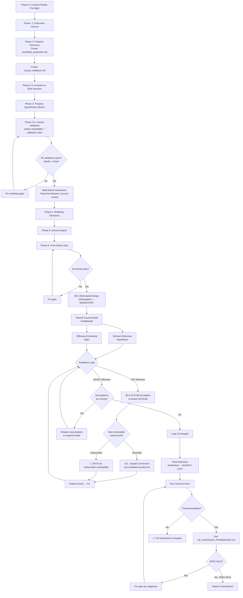

# Certora Specification Workflow — Complete Guide

> **Version:** 3.2 (Optimization Pressure + Temporal Depth + Design Hostility)  
> **Purpose:** Step-by-step workflow for writing correct Certora specifications  
> **Philosophy:** Understand completely → Model correctly → Validate reachability → Attack ⇄ Defend (feedback loop) → Prove last

---

## Framework Overview

This workflow integrates **five** core documents:

```
┌─────────────────────────────────────────────────────────────────────────────┐
│                    CERTORA SPECIFICATION WORKFLOW v3.2                       │
├─────────────────────────────────────────────────────────────────────────────┤
│                                                                             │
│  ┌───────────────────────┐    ┌───────────────────────┐    ┌─────────────┐ │
│  │  SPEC AUTHORING       │    │  SPEC FRAMEWORK       │    │ CE DIAGNOSIS│ │
│  │  (CERTORA).md         │───▶│  .md                  │───▶│ FRAMEWORK   │ │
│  │                       │    │                       │    │ .md         │ │
│  │  • Understand         │    │  • Write CVL          │    │  • Debug    │ │
│  │  • Model              │    │  • Patterns           │    │  • Classify │ │
│  │  • Classify           │    │  • Templates          │    │  • Fix      │ │
│  └───────────────────────┘    └───────────────────────┘    └─────────────┘ │
│         Phase 0-6                   Phase 7                  When needed   │
│                                          │                                  │
│  ┌───────────────────────┐              │      ┌─────────────────────────┐ │
│  │  BEST PRACTICES       │──────────────┴─────▶│  CATEGORIZING           │ │
│  │  FROM CERTORA.md      │                     │  PROPERTIES.md          │ │
│  │                       │                     │                         │ │
│  │  • Property Discovery │                     │  • Prioritization       │ │
│  │  • Common Pitfalls    │                     │  • Dual Mindset         │ │
│  │  • Invariant Patterns │                     │  • Test Mining          │ │
│  └───────────────────────┘                     └─────────────────────────┘ │
│        NEW v1.3                                       Enhanced v1.3        │
│                                                                             │
└─────────────────────────────────────────────────────────────────────────────┘
```

---

## Workflow Diagram



---

## Step-by-Step Instructions

### STEP 0: PROJECT SETUP

Create this folder structure:

```
project_name/
├── contracts/                    # Your Solidity contracts
├── certora/
│   ├── specs/
│   │   ├── Common.spec          # Shared summaries (optional)
│   │   └── [Contract].spec      # Actual spec (Phase 7)
│   ├── confs/
│   │   └── [Contract].conf      # Certora config
│   └── harnesses/               # Harness contracts if needed
├── spec_authoring/
│   ├── spec_authoring.md        # Main workspace (Phase 0-6)
│   ├── candidate_properties.md  # Plain English properties (Phase 2)
│   └── causal_validation.md     # Causal analysis (Phase 3.5)
└── docs/
    ├── spec-authoring-certora.md
    ├── certora-spec-framework.md
    ├── certora-ce-diagnosis-framework.md
    └── certora-workflow.md (this file)
```

---

### STEP 1: CONTRACT ANALYSIS (Phase 0 & -1)

**Open:** `spec_authoring.md`  
**Reference:** `spec-authoring-certora.md` Phase 0 and Phase -1

#### 1.1 Complete Phase 0: Contract Reality Pre-flight

Fill in these tables:

**Verification Boundary:**
| Category | Contracts |
|----------|-----------|
| Primary (under verification) | |
| In-scope (fully modeled) | |
| Out-of-scope (must be modeled) | |

**Entry Points:**
| Function | Visibility | State-Changing? | External Reads? | External Writes? |
|----------|------------|-----------------|-----------------|------------------|
| | | | | |

**State Mutation Map:**
| Function | Writes | Reads | External Writes | External Reads |
|----------|--------|-------|-----------------|----------------|
| | | | | |

**Asset Flow Trace:**
| Asset | Owner Contract | Mutation Functions | Read-only Checks | Reentrancy Window? |
|-------|----------------|-------------------|------------------|-------------------|
| | | | | |

**Trust Boundaries:**
| Actor | Category | Powers | Assumed Honest? |
|-------|----------|--------|-----------------|
| | Code-Enforced / Modeled-Adversarial / Threat-Model | | |

#### 1.2 Complete Phase -1: Execution Closure

**Execution Universe:**
| Contract | Relationship | In Call Graph? |
|----------|--------------|----------------|
| | Direct call / Callback / Delegatecall / etc. | |

**Interaction Ownership Table:**
| Contract | Owns Which Truth? | Reads | Writes | Callbacks |
|----------|-------------------|-------|--------|-----------|
| | | | | |

**Modeling Obligations:**
| Truth | Owner | Modeling Strategy | Justification |
|-------|-------|-------------------|---------------|
| | | DISPATCHER / CONSTANT / NONDET / assume | |

**Read/Write Pairing:**
| External Read | Paired Write(s) | Modeled? |
|---------------|-----------------|----------|
| balanceOf() | transfer, mint, burn | |
| | | |

**✅ CHECKPOINT:** All tables complete? Proceed to Step 2.

---

### STEP 2: PROPERTY DISCOVERY (Phase 2)

**Create:** `candidate_properties.md`

```markdown
# Candidate Security Properties - [PROJECT_NAME]

## A. Valid States (State-Inductive Safety)
*Properties that must hold in EVERY reachable state*

### A1. [Property Name]
**Plain English:** [Description of what must always be true]
**Impact if Violated:** [Theft / Insolvency / Privilege Escalation / Griefing]
**Variables Involved:** [List storage variables and their owners]
**External Truths:** [List external contract dependencies]

### A2. [Property Name]
...

## B. State Transitions (Transition Properties)
*Properties about how state changes*

### B1. [Property Name]
**Plain English:** [Description of valid/invalid transitions]
**Triggering Function(s):** [Which functions affect this]
**Impact if Violated:** [Category]
**Variables Involved:** [List]
**External Truths:** [List]

### B2. [Property Name]
...

## C. Access Control
*Who can do what*

### C1. [Property Name]
**Plain English:** [Only X can call Y]
**Protected Function:** [Function name]
**Authorized Caller:** [Role/address]
**Impact if Violated:** [Category]

### C2. [Property Name]
...

## D. Conservation Laws
*What must be preserved*

### D1. [Property Name]
**Plain English:** [X is conserved across Y]
**Conserved Quantity:** [What]
**Scope:** [Global / Per-user / Per-pool]
**Impact if Violated:** [Category]

### D2. [Property Name]
...
```

🚫 **NO CVL SYNTAX.** No `invariant` or `rule` decisions yet.

**✅ CHECKPOINT:** All candidate properties listed in plain English? Proceed to Step 3.

---

### STEP 3: CREATE CAUSAL VALIDATION DOCUMENT

**Create:** `causal_validation.md`

```markdown
# Causal Validation - [PROJECT_NAME]

## Project Execution Context

**Primary Contract:** [ContractName]

**External Dependencies:**
| Contract | Modeling Strategy | Justification |
|----------|-------------------|---------------|
| | | |

**Ghosts Planned:**
| Ghost | Purpose | Storage Dependencies |
|-------|---------|---------------------|
| | | |

---

## Property Analysis

### [PROPERTY_A1]
**Source:** candidate_properties.md → A1
**Type:** [TBD - will be decided in Step 4]

**Variables Involved:**
| Variable | Type | Location | Owner | Purpose |
|----------|------|----------|-------|---------|
| | | Storage/Ghost | | |

**Mutation Paths for `[variable1]`:**
| Function | Effect | Modeled? | Hook Needed? |
|----------|--------|----------|--------------|
| | | ✅/❌ | ✅/❌ |
| constructor() | Initial value | | init_state axiom |

**Mutation Paths for `[variable2]`:**
| Function | Effect | Modeled? | Hook Needed? |
|----------|--------|----------|--------------|
| | | | |

**Causal Closure Checklist:**
- [ ] All mutation paths for all variables enumerated
- [ ] Constructor effects documented
- [ ] Hook requirements identified
- [ ] External dependencies modeled

---

### [PROPERTY_A2]
... [same structure]

### [PROPERTY_B1]
... [same structure]
```

**✅ CHECKPOINT:** Causal validation document created for all properties? Proceed to Step 4.

---

### STEP 4: INVARIANT vs RULE DECISION (Phase 2.5)

**For EACH property** in `candidate_properties.md`, apply the decision gate:

```
┌──────────────────────────────────────────────────────────────┐
│ Q0: Is all state referenced owned by verified contract       │
│     or explicitly modeled?                                   │
├──────────────────────────────────────────────────────────────┤
│ ❌ No  → STOP. Complete modeling first.                     │
│ ✅ Yes → Continue                                            │
└──────────────────────────────────────────────────────────────┘
                              │
                              ▼
┌──────────────────────────────────────────────────────────────┐
│ Q1: Is the question "Can this EVER happen?"                  │
│     (regardless of how we got there)                         │
├──────────────────────────────────────────────────────────────┤
│ ✅ Yes → INVARIANT                                           │
│ ❌ No  → Continue                                            │
└──────────────────────────────────────────────────────────────┘
                              │
                              ▼
┌──────────────────────────────────────────────────────────────┐
│ Q2: Does it depend on a specific function call,              │
│     caller identity, or call sequence?                       │
├──────────────────────────────────────────────────────────────┤
│ ✅ Yes → RULE                                                │
│ ❌ No  → Continue                                            │
└──────────────────────────────────────────────────────────────┘
                              │
                              ▼
┌──────────────────────────────────────────────────────────────┐
│ Q2.5: Does it depend on external state not fully enforced    │
│       by this contract?                                      │
├──────────────────────────────────────────────────────────────┤
│ ✅ Yes → RULE (not invariant)                                │
│ ❌ No  → Continue                                            │
└──────────────────────────────────────────────────────────────┘
                              │
                              ▼
┌──────────────────────────────────────────────────────────────┐
│ Q3: Would a single violation leave the protocol              │
│     irrecoverably broken?                                    │
├──────────────────────────────────────────────────────────────┤
│ ✅ Yes → INVARIANT                                           │
│ ❌ No  → Continue                                            │
└──────────────────────────────────────────────────────────────┘
                              │
                              ▼
┌──────────────────────────────────────────────────────────────┐
│ Q4: Does violation require a trusted role to misbehave?      │
├──────────────────────────────────────────────────────────────┤
│ ✅ Yes → OUT OF SCOPE (document in threat model)             │
│ ❌ No  → RULE                                                │
└──────────────────────────────────────────────────────────────┘
```

**Update both documents:**

In `candidate_properties.md`:
```markdown
### A1. [Property Name]
**Plain English:** ...
**Decision:** INVARIANT
**Decision Path:** Q0✅ → Q1✅ (Can this ever happen? Yes → INVARIANT)
```

In `causal_validation.md`:
```markdown
### [PROPERTY_A1]
**Type:** INVARIANT
**Classification Reason:** Answers "can balance ever exceed supply?" — global state condition
```

**✅ CHECKPOINT:** All properties classified? Proceed to Step 5.

---

### STEP 5: PROPERTY SPECIFICATION BLOCKS (Phase 3)

**Update:** `spec_authoring.md` with final specification blocks:

```markdown
## PROPERTY SPECIFICATION BLOCKS

### Property: [invariant_solvency]
**Name:** invariant_solvency
**Type:** Invariant
**Impact Category:** Insolvency
**Plain English:** The sum of all balances always equals total supply
**Source:** candidate_properties.md → D1

**Variables:**
| Variable | Owner | Modeled As |
|----------|-------|------------|
| balances[user] | This contract | Storage |
| totalSupply | This contract | Storage |
| sumBalances | N/A (aggregate) | Ghost |

**External Truths Used:** None

**Dependencies:**
- Requires: zeroAddressHasNoBalance (must be proven first)

**Causal Validation Status:** [PENDING/PASSED]

---

### Property: [rule_transferDecreasesSource]
**Name:** rule_transferDecreasesSource
**Type:** Rule
**Impact Category:** Theft
**Plain English:** After transfer, sender's balance decreases by exactly amount
**Source:** candidate_properties.md → B1

... [same structure]
```

**✅ CHECKPOINT:** All property spec blocks created? Proceed to Step 6.

---

### STEP 6: CAUSAL VALIDATION (Phase 3.5)

**This is the critical verification step.**

For EACH property, write and run validation rules.

#### 6.1 Create Validation Spec

Create `certora/specs/validation_[project].spec`:

```cvl
/**
 * CAUSAL VALIDATION RULES
 * Run these BEFORE writing the actual spec
 * All rules must PASS before proceeding
 */

methods {
    // Include all methods from your modeling
    function balanceOf(address) external returns (uint256) envfree;
    function totalSupply() external returns (uint256) envfree;
    function transfer(address, uint256) external returns (bool);
    // ... etc.
}

// Ghost for validation
ghost mathint sumBalances {
    init_state axiom sumBalances == 0;
}

// Hook for validation
hook Sstore balances[KEY address user] uint256 newBal (uint256 oldBal) {
    sumBalances = sumBalances + newBal - oldBal;
}

// ══════════════════════════════════════════════════════════════
// VALIDATION RULE 0: Function Reachability (satisfy)   NEW v1.8
// ══════════════════════════════════════════════════════════════
// Before proving ANY assert, prove each function CAN execute
// without reverting. If satisfy fails → every assert is vacuous.

rule reachability_transfer() {
    env e; address to; uint256 amount;
    require e.msg.sender != 0;
    require e.msg.value == 0;
    transfer@withrevert(e, to, amount);
    satisfy !lastReverted, "transfer is reachable (non-reverting path exists)";
}

rule reachability_mint() {
    env e; address to; uint256 amount;
    require e.msg.sender != 0;
    require e.msg.value == 0;
    mint@withrevert(e, to, amount);
    satisfy !lastReverted, "mint is reachable (non-reverting path exists)";
}

// Repeat for EVERY state-changing function.
// If ANY satisfy is VIOLATED → STOP. Fix harness / DISPATCHER / require.

// ══════════════════════════════════════════════════════════════
// VALIDATION RULE 1: Mutation Path Completeness for balances
// ══════════════════════════════════════════════════════════════
rule mutation_paths_balances(method f, address user) 
    filtered { 
        f -> f.contract == currentContract &&
             !f.isView
    } 
{
    uint256 balanceBefore = balanceOf(user);
    
    env e;
    calldataarg args;
    f(e, args);
    
    uint256 balanceAfter = balanceOf(user);
    
    // If balance changed, must be through expected functions
    assert balanceBefore != balanceAfter => (
        f.selector == sig:transfer(address,uint256).selector ||
        f.selector == sig:transferFrom(address,address,uint256).selector ||
        f.selector == sig:mint(address,uint256).selector ||
        f.selector == sig:burn(address,uint256).selector
    ), "Unmodeled mutation path for balances";
}

// ══════════════════════════════════════════════════════════════
// VALIDATION RULE 2: Ghost Synchronization
// ══════════════════════════════════════════════════════════════
rule ghost_sync_sumBalances(method f) 
    filtered { f -> f.contract == currentContract }
{
    env e;
    calldataarg args;
    f(e, args);
    
    // After any function, ghost should match reality
    // (This verifies hooks are complete)
    // Note: Can't directly verify sum, but can verify invariant form
    assert sumBalances >= 0, "Ghost became negative (impossible)";
}

// ══════════════════════════════════════════════════════════════
// VALIDATION RULE 3: Constructor Establishes Properties
// ══════════════════════════════════════════════════════════════
rule constructor_establishes_solvency {
    // Fresh deployment state
    require totalSupply() == 0;
    require sumBalances == 0;
    
    // Property must hold
    assert to_mathint(totalSupply()) == sumBalances,
        "Solvency not established at deployment";
}
```

#### 6.2 Run Validation

```bash
certoraRun certora/confs/validation_[project].conf
```

#### 6.3 Interpret Results

| Rule Result | Meaning | Action |
|-------------|---------|--------|
| `reachability_*` PASS | Function can execute without reverting | ✅ Proceed |
| `reachability_*` VIOLATED | Function always reverts — all asserts are vacuous | Fix preconditions, harness, or DISPATCHER |
| `mutation_paths_*` PASS | All mutation paths known | ✅ Proceed |
| `mutation_paths_*` FAIL | Unknown function mutates variable | Add to mutation list, may need hook |
| `ghost_sync_*` PASS | Hooks are complete | ✅ Proceed |
| `ghost_sync_*` FAIL | Missing hook for some path | Add Sstore hook |
| `constructor_*` PASS | Initial state satisfies property | ✅ Proceed |
| `constructor_*` FAIL | Need init_state axiom or model constructor | Fix initialization |

#### 6.4 Update Causal Validation Document

```markdown
### [PROPERTY_A1]
...
**Validation Rules:**
- [x] reachability_transfer: PASSED
- [x] reachability_mint: PASSED
- [x] mutation_paths_balances: PASSED
- [x] ghost_sync_sumBalances: PASSED  
- [x] constructor_establishes_solvency: PASSED

**Causal Closure Status:** ✅ VERIFIED
```

🚫 **Do NOT proceed until ALL validation rules PASS for ALL properties.**

**✅ CHECKPOINT:** All validation rules pass? Proceed to Step 7.

---

### STEP 7: MODELING DECISIONS (Phase 4)

Complete modeling decisions in `spec_authoring.md`:

```markdown
## MODELING DECISIONS

### ERC20 Tokens
| Function | Strategy | Justification |
|----------|----------|---------------|
| transfer | DISPATCHER | Multiple token implementations possible |
| balanceOf | DISPATCHER | Need real balance tracking |
| approve | DISPATCHER | Allowance tracking needed |

### Oracles
| Function | Strategy | Justification |
|----------|----------|---------------|
| getPrice | assume (with bounds) | Trust assumption: oracle returns reasonable values |

### External Contracts
| Contract | Strategy | Justification |
|----------|----------|---------------|
| Registry | CONSTANT | Addresses immutable after deployment |
```

**✅ CHECKPOINT:** All modeling decisions documented? Proceed to Step 8.

---

### STEP 8: GHOST ANALYSIS (Phase 5)

```markdown
## GHOST ANALYSIS

### Ghosts Required:
| Ghost | Type | Purpose | Synchronized Via |
|-------|------|---------|------------------|
| sumBalances | mathint | Track sum of all balances | Sstore hook on balances |

### Ghost Validity Checks:
- [ ] No ghost mirrors individual owned storage
- [ ] All ghosts track aggregates or cross-contract state
- [ ] All ghosts have init_state axioms
- [ ] All ghosts have complete Sstore hooks
- [ ] All ghosts have Sload hooks (if needed for relationships)
```

**✅ CHECKPOINT:** Ghost analysis complete? Proceed to Step 9.

---

### STEP 9: FINAL SANITY GATE (Phase 6)

**Reference:** `spec-authoring-certora.md` Phase 6

Go through EVERY checkbox. ALL must pass.

```markdown
## FINAL SANITY GATE

### Execution Closure
- [ ] All entry points enumerated
- [ ] All state mutations mapped
- [ ] All external reads modeled or trusted
- [ ] Every external read has a modeled write
- [ ] All NONDET usages justified
- [ ] All contract-typed addresses bound

### Causal Closure
- [ ] Causal validation PASSED for ALL properties
- [ ] All mutation paths enumerated
- [ ] All ghosts have hooks for every path
- [ ] Constructor effects modeled
- [ ] No HAVOC paths to property variables

### Bounded State
- [ ] Array lengths bounded (< 1000)
- [ ] Timestamps bounded (<= max_uint40)
- [ ] Counters bounded realistically
- [ ] Loop bounds in preserved blocks

### Property Quality
- [ ] No property mixes truth owners
- [ ] No ghost competes with storage
- [ ] No hidden assumptions
- [ ] No exploit required away

### Edge Cases
- [ ] block.timestamp analyzed
- [ ] block.number analyzed
- [ ] msg.value analyzed
- [ ] Rounding analyzed
- [ ] Zero-value cases analyzed
```

🚫 **ALL boxes must be checked. If any fails, go back and fix.**

**✅ CHECKPOINT:** All sanity checks pass? Proceed to Step 10.

---

### STEP 10: WRITE CVL SPEC (Phase 7)

**Now and ONLY now, write the actual CVL spec.**

**Reference:** `certora-spec-framework.md` for:
- Methods block structure
- Ghost and hook templates
- validState() pattern
- Invariant and rule patterns
- CVL 2.0 syntax

**Also reference (NEW v1.5):**
- `cvl-language-deep-dive.md` — Type system, ghosts, hooks, invariant lifecycle
- `verification-playbooks.md` — Copy-paste ERC-20/WETH/ERC-721 examples

**Spec Structure:**
```cvl
// 1. Imports
import "Common.spec";

// 2. Using declarations
using Token as token;

// 3. Methods block (from Phase 4)
methods { ... }

// 4. Ghosts (from Phase 5)
ghost mathint sumBalances { ... }

// 5. Hooks (from causal validation)
hook Sstore ... { ... }

// 6. Helper functions
function validState() { ... }
function validEnv(env e) { ... }

// 7. Invariants (ordered by dependency)
invariant level1_invariant() ...
invariant level2_invariant() ...

// 8. Rules
rule myRule(env e, ...) {
    validState();
    validEnv(e);
    ...
}
```

---

### STEP 11: RUN PROVER

```bash
certoraRun certora/confs/[Contract].conf
```

---

### STEP 12: HANDLE COUNTEREXAMPLES

If prover returns counterexamples:

**Reference:** `certora-ce-diagnosis-framework.md`

1. Complete Phase -1 closure checks
2. If any fail → SPEC BUG → Fix per Phase B
3. If all pass → Analyze CE → Classify as REAL BUG or SPEC BUG
4. Iterate until verification passes or real bugs found

---

## Quick Reference Cards

### Document Purpose

| Document | Use When |
|----------|----------|
| `spec-authoring-certora.md` | Understanding contract, modeling, classifying |
| `certora-spec-framework.md` | Writing CVL code |
| `cvl-language-deep-dive.md` | CVL type system, ghosts, hooks, invariants ⭐ NEW v1.5 |
| `verification-playbooks.md` | Copy-paste worked examples ⭐ NEW v1.5 |
| `certora-ce-diagnosis-framework.md` | Debugging counterexamples |
| `advanced-cli-reference.md` | Performance optimization, timeouts ⭐ NEW v1.4 |
| `best-practices-from-certora.md` | Proven techniques & patterns |
| `certora-workflow.md` | Following the process |
| `impact-spec-template.md` | Economic impact tracking, anti-invariants ⭐ NEW v3.0 |
| `multi-step-attacks-template.md` | Flash loan, sandwich, staged attacks ⭐ NEW v3.0 |

### File Purpose

| File | Contains |
|------|----------|
| `spec_authoring.md` | Phase 0-6 analysis output |
| `candidate_properties.md` | Plain English properties + decisions |
| `causal_validation.md` | Per-property causal analysis |
| `validation_*.spec` | Causal validation CVL rules |
| `[Contract].spec` | Final CVL specification |

### Phase Summary

| Phase | Question Answered | Output |
|-------|-------------------|--------|
| 0 | What is the contract reality? | Entry points, mutations, flows |
| -1 | What is the execution universe? | Ownership table, modeling obligations |
| 2 | What could go wrong? | Candidate properties (plain English) |
| 2.5 | Invariant or rule? | Classified properties |
| 3 | What exactly are we verifying? | Property spec blocks |
| 3.5 | Is causal closure proven? | Validation rules PASSED |
| 4 | How do we model externals? | Modeling decisions |
| 5 | Do we need ghosts? | Ghost analysis |
| 6 | Are we ready? | All sanity checks PASSED |
| 6→7 | Design hostile? | Adversarial design interrogation — attacker objectives, profit metrics ← **NEW v3.2** |
| 7 | Write the spec | CVL spec file |
| 8 | Can we break it? (Offensive) | Anti-invariants, CE→exploits, profit escalation ← **UPDATED v3.2** |

---

## Remember

> **Understand completely → Model correctly → Write once → Debug systematically**

The time invested in Phases 0 through 6 saves exponentially more time in debugging.
